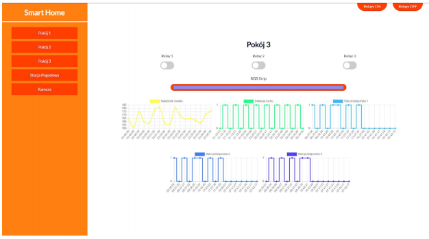
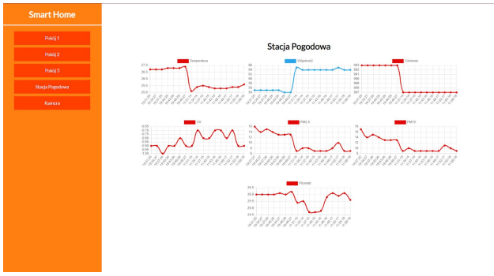
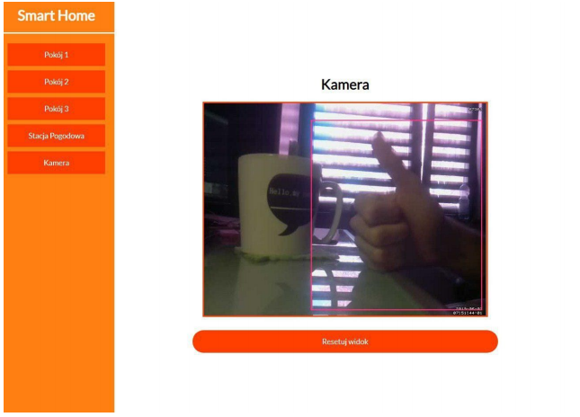

# Smart Home - Front End

Web application for interacting with Smart Home hardware. App shows camera and data sensors from 3 given rooms and a weather station.

**For backend of this Smart Home application go to `wbudowane_backend` repository!**

## Screenshots

